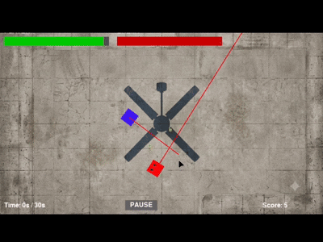
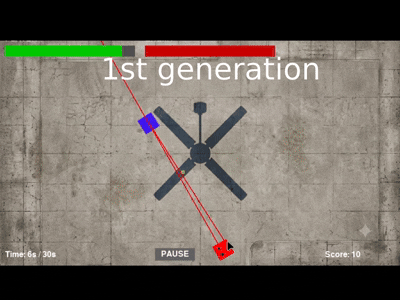
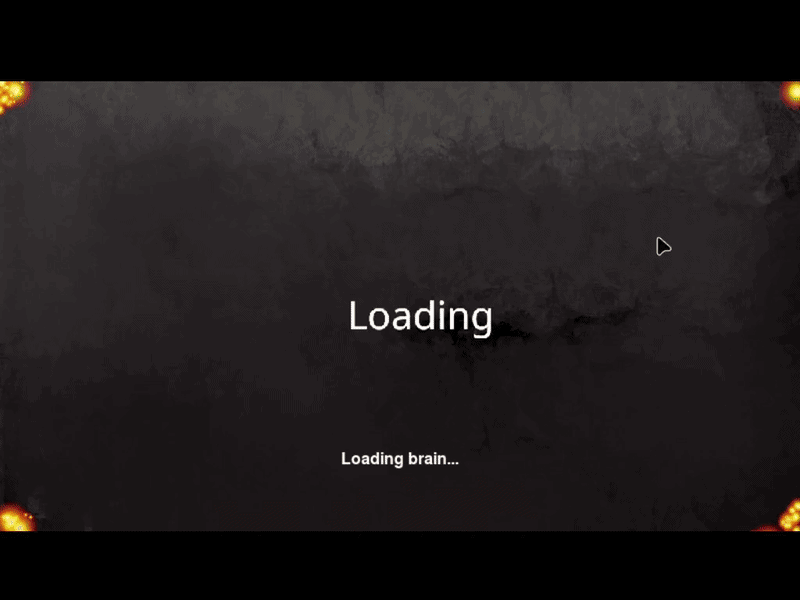
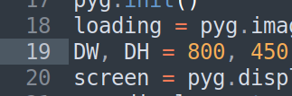
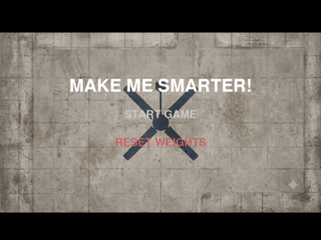

# Self-Evolving Game AI


[](https://www.python.org/)
[](https://www.pygame.org/news)
[](LICENSE)
[](https://github.com/Khadusgrinder123/Self-Evolving-Game-AI)

<p align="center">
  <!-- Hero GIFs: edit filenames or sizes as needed -->
  
- BASE GENERATION
  

if you want to play and improve through base gen you can do that,
but if you want to train from scratch delete the base weights.

- TRAINING GENERATION (from scratch)
  

- 20th generation (from scratch)
  
</p>

> A lightweight top-down shooter where the enemy is a self-evolving AI that learns your play patterns in real time and adapts to beat you using clever strategies while avoiding cowardly or exploitative behavior.

Quick links
- Live preview images and gifs: gifs/
- Main game file: `MainGamePC.py`
- Saved AI brain: `best_brain.pkl`

---

## Quick start

1. Ensure Python 3.8 or newer is installed on your machine.
2. Create and activate a virtual environment (recommended):
   - macOS / Linux:
     - python3 -m venv venv
     - source venv/bin/activate
   - Windows:
     - python -m venv venv
     - venv\Scripts\activate
3. Install dependencies:
   - pip install pygame numpy
   - Or, if you add a requirements file: pip install -r requirements.txt
4. Run the game:
   - python MainGamePC.py
   - On some systems use: python3 MainGamePC.py

---

## Requirements

- Python 3.8 or newer
- pygame
- numpy
- Optional: pip, virtualenv


---

## Game controls

| Input | Action |
|---:|---|
| W / A / S / D | Move player up / left / down / right |
| Mouse left-click | Fire bullet |
| P | Pause / resume |
| R | Save current neural network to `best_brain.pkl` |
| T | Dump a debug log (`log.pkl`) with player and enemy state |
| Click "RESET WEIGHTS" in the menu | Permanently delete `best_brain.pkl` and reset the AI |

Note: There is a pause and menu button on screen. When paused, click MENU to save progress and return to main menu.

---

## How resetting weights works

There is a "RESET WEIGHTS" item on the main menu. Activating it deletes `best_brain.pkl` if present and replaces the brain with a fresh network. The `gifs/how_to_reset_weights.gif` demonstrates this flow. Add that gif near this section or next to the menu screenshot.

---

## Technical highlights

- Simple recurrent neural network (RNN) implemented with numpy.
- State extraction with relative positions, nearest bullet positions, wall proximity, and time features.
- On-round dynamic fitness calculation that balances score, distance, and survival time.
- Evolution strategy: saves best brain and loads a mutated copy for exploration between rounds.
- Lightweight and intentionally easy to extend for experimentation.

---

## Repo structure (suggested)

- MainGamePC.py - main game executable and AI loop
- README.md - this file
- best_brain.pkl - saved best network (binary)
- gifs/ - animated previews and how-to gifs
  - base_gen.gif
  - final_gen.gif
  - training_gen.gif
  - how_to_reset_weights.gif
  - etlin_169_ratio.png
- *.png / *.ogg - assets (background.png, player.png, enemy.png, shoot.ogg, etc.)

---

## Visuals and recommended placement for gifs

Place the following files inside the `gifs/` folder (they are already there according to your note). Add the hero GIFs at the top of the README (as in this file) so visitors see motion first.

File descriptions (use these captions in the README or next to each gif):
- gifs/base_gen.gif - How the base generation AI plays
- gifs/final_gen.gif - After deleting base weights, the 20th generation plays like this
- gifs/training_gen.gif - Training from scratch for several generations
- gifs/how_to_reset_weights.gif - Shows how to reset the weights from the menu
- gifs/etlin_169_ratio.png - A 16:9 preview image; edit the width or replace this file to match your device

Markdown examples you can paste or tweak:

Inline hero trio:
```html
<p align="center">
  
  
  
</p>

DW = display width
DH = display height

<p align="center">
  
</p>



---

## Design and development notes (from MainGamePC.py)

I briefly inspected `MainGamePC.py` to ensure the README reflects actual behavior:
- The AI is an RNN implemented in `RecurrentNeuralNetwork` using numpy with input size 16 and hidden size 32.
- The game runs rounds of fixed duration (30 seconds), and the code calculates a dynamic fitness each round, saving the model when it outperforms previous results.
- Player controls are W/A/S/D for movement and mouse click to shoot. Keys: P pauses, R saves brain, T writes a debug log.
- The main menu offers "START GAME" and "RESET WEIGHTS". Reset removes `best_brain.pkl`.
- Audio and image assets are loaded from repository root via `resource_path`, so relative paths like `gifs/...` are the correct approach for README previews.

---

## Call to action

If you like experiments with AI, please:
- Star the repo if you find it useful
- Try training several runs and share GIFs of interesting behaviors
- Open issues for bugs or feature requests
- Submit pull requests for improvements: training UI, checkpoints, or better fitness metrics

---
